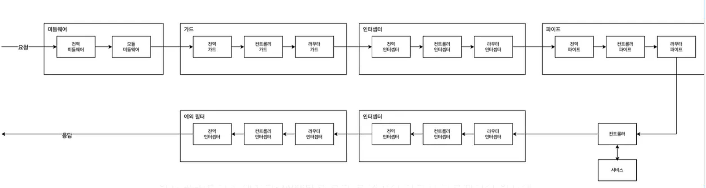
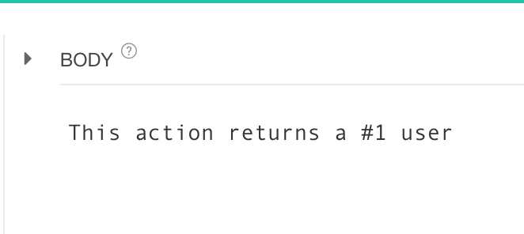
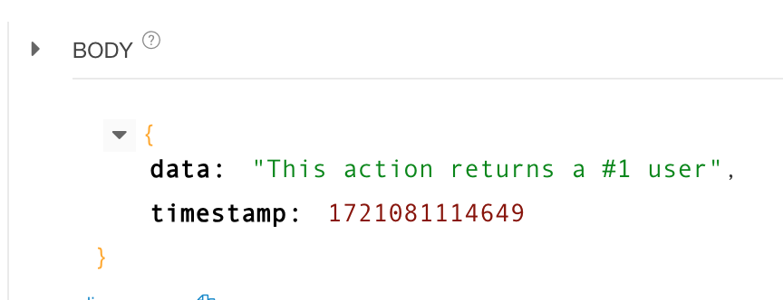
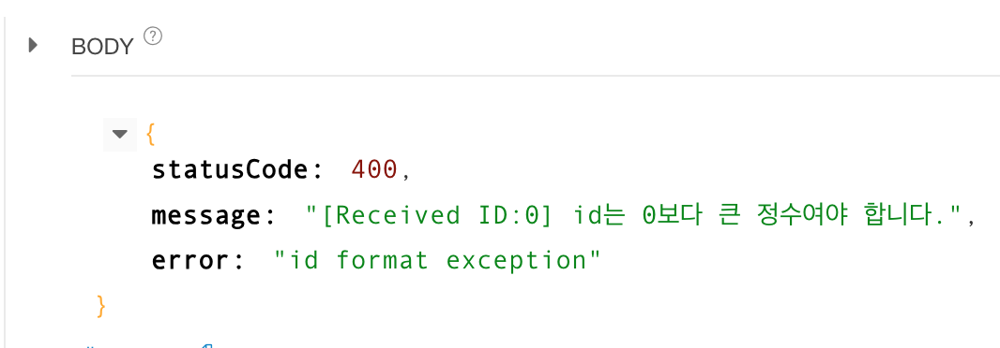
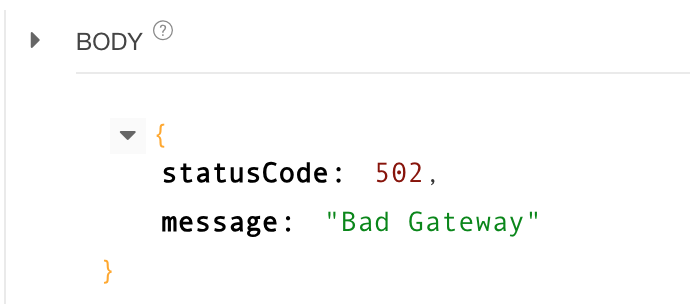
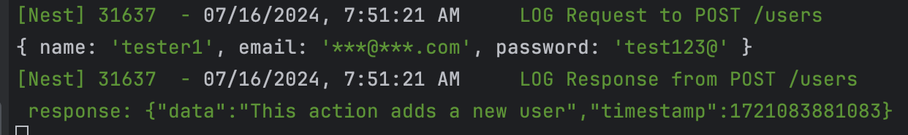

# 13. Interceptor
### 인터셉터란?
> 요청과 응답을 가로채서 변형을 가할 수 있는 컴포넌트 <br/>
- 메서드 실행 전/후 추가 로직을 바인딩
- 함수에서 반환된 결과를 변환
- 함수에서 던져진 예외를 변환
- 기본 기능 동작의 확장
- 특정 조건에 따라 기능을 완전히 재정의(캐싱 등)




### 기본적인 인터셉터
```js
// logging.interceptor.ts
@Injectable()
export class LoggingInterceptor implements NestInterceptor {
  intercept(context: ExecutionContext, next: CallHandler): Observable<any> {
    console.log('Before...');
    const now = Date.now();
    return next
      .handle()
      .pipe(tap(() => console.log(`After... ${Date.now() - now}ms`)));
  }
}

// main.ts
async function bootstrap() {
  const app = await NestFactory.create(AppModule);
  app.useGlobalInterceptors(new LoggingInterceptor());
  await app.listen(3000);
}
bootstrap();
```
- 1. @nest/common의 NestInterceptor 인터페이스 구현
- 2. NestInterceptor의 intercept 함수 구현

### NestInterceptor 정의
```js
export interface CallHandler<T = any> {
  /**
   * Returns an `Observable` representing the response stream from the route
   * handler.
   */
  handle(): Observable<T>;
}
/**
 * Interface describing implementation of an interceptor.
 *
 * @see [Interceptors](https://docs.nestjs.com/interceptors)
 *
 * @publicApi
 */
export interface NestInterceptor<T = any, R = any> {
  /**
   * Method to implement a custom interceptor.
   *
   * @param context an `ExecutionContext` object providing methods to access the
   * route handler and class about to be invoked.
   * @param next a reference to the `CallHandler`, which provides access to an
   * `Observable` representing the response stream from the route handler.
   */
  intercept(context: ExecutionContext, next: CallHandler<T>): Observable<R> | Promise<Observable<R>>;
}
```
>ExecutionContext:
ExecutionContext는 현재 요청에 대한 컨텍스트를 나타냅니다. 이 객체를 통해 라우트 핸들러와 관련된 정보에 접근할 수 있습니다. 이를 통해 요청 객체(request object), 응답 객체(response object), 핸들러(handler), 클래스(class) 등에 접근할 수 있습니다.

>CallHandler:
CallHandler는 다음 단계의 핸들러를 호출하는 역할을 합니다. CallHandler의 handle 메서드는 라우트 핸들러에서 반환된 응답 스트림을 나타내는 Observable을 반환합니다. 이를 통해 인터셉터는 라우트 핸들러에서 반환된 응답을 가로채고, 수정하거나 로깅 등의 작업을 수행할 수 있습니다.

>Generic Types (T and R) in NestInterceptor:
T: 인터셉터가 처리하는 요청 데이터의 타입을 나타냅니다.
R: 인터셉터가 반환하는 응답 데이터의 타입을 나타냅니다. R은 일반적으로 Observable로 감싼 타입입니다.

```js
// transform.interceptor.ts
@Injectable()
export class TransformInterceptor<T> implements NestInterceptor<T, Response<T>> {
  intercept(context: ExecutionContext, next: CallHandler): Observable<Response<T>> {
  console.log('Before...');
  return next.handle().pipe(
    map((data) => {
      return {
        data,
        timestamp: Date.now(),
      };
    }),
  );
}}

// main.ts
async function bootstrap() {
  const app = await NestFactory.create(AppModule);
  app.useGlobalInterceptors(
    new LoggingInterceptor(),
    new TransformInterceptor(),
  );
  await app.listen(3000);
}
bootstrap();
```
- Response를 가공한 Interceptor 적용




### 라우터 레벨 적용 - 예외 변환
```js
// errors.interceptor.ts
@Injectable()
export class ErrorsInterceptor implements NestInterceptor {
  intercept(context: ExecutionContext, next: CallHandler): Observable<any> {
    return next
      .handle()
      .pipe(catchError((err) => throwError(() => new BadGatewayException())));
  }
}

// user.controller.ts
@UseInterceptors(ErrorsInterceptor)
@Get(':id')
findOne(@Param('id') id: string) {
  if (+id < 1) {
    throw new BadRequestException(
      `[Received ID:${id}] id는 0보다 큰 정수여야 합니다.`,
      'id format exception',
    );
  }

  return this.usersService.findOne(+id);
}
```




- 예외 변환의 경우 인터셉터도 가능하지만, 예외 필터에서 다루는게 더 나음
> 예외 필터:
<br/>용도: 예외 처리, 로깅, 응답 변환 등 예외 발생 시의 모든 처리 로직에 적합합니다.
<br/>명확성: 예외 처리를 위한 표준적인 방법으로 코드의 가독성과 유지보수성이 높습니다.
<br/>구체성: 특정 예외 유형에 대해 세부적인 처리가 가능합니다.

>인터셉터:
<br/>용도: 요청 및 응답 변환, 로깅, 성능 모니터링 등 비즈니스 로직 전후의 처리가 필요할 때 사용합니다.
<br/>유연성: 요청/응답 흐름의 전반적인 처리 로직을 삽입하는 데 유용합니다.
<br/>응답 변환: 주로 성공적인 요청에 대한 응답 변환을 수행합니다.

```js
// logging.interceptor.ts
@Injectable()
export class LoggingInterceptor implements NestInterceptor {
  constructor(private logger: Logger) {}

intercept(context: ExecutionContext, next: CallHandler): Observable<any> {
  const request = context.switchToHttp().getRequest();
  const { method, url, body } = request;
  this.logger.log(`Request to ${method} ${url}`);

  if (body?.email) {
  body.email = '***@***.com'; // 예: 비밀 값을 마스킹
}
  
  return next
    .handle()
    .pipe(
      tap((data) =>
        this.logger.log(
          `Response from ${method} ${url} \n response: ${JSON.stringify(
            data,
          )}`,
        ),
      ),
    );
}}

// logging.module.ts
import { Logger, Module } from '@nestjs/common';
import { APP_INTERCEPTOR } from '@nestjs/core';
import { LoggingInterceptor } from '../interceptor/logging.interceptor';

@Module({
  providers: [
    Logger,
    { provide: APP_INTERCEPTOR, useClass: LoggingInterceptor },
  ],
})
export class LoggingModule {}

//user.controller.ts
@Post()
create(@Body() createUserDto: CreateUserDto) {
  console.log(createUserDto);
  return this.usersService.create(createUserDto);
}
```
