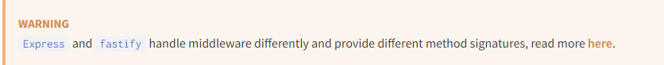

# Nestjs Study 

## Pipes


Pipe 목적:

- 변환(transformation): 입력 데이터를 원하는 형식으로 변한. 예를 들어 users/user/1 내의 경로 매개변수 문자열 1을 정수로 변환 
- 유효성 검사(validation): 입력 데이터가 사용자가 정한 기준에 유효하지 않은 경우 예외처리

## Built-in pipes
nest/common 패키지에 내장 파이프 
- ValidationPipe
- ParseIntPipe
- ParseFloatPipe
- ParseBoolPipe
- ParseArrayPipe
- ParseUUIDPipe
- ParseEnumPipe
- DefaultValuePipe
- ParseFilePipe

## Binding pipes (ParseIntPipe example)
1. /users/user/:id 에 전달된 매개변수 id(문자열)을 정수타입으로 변환
```bash
@Get(':id')
async findOne(@Param('id', ParseIntPipe) id: number) {
  return this.userService.findOne(id);
}
```
2. 파싱 가능하지 않은 문자열 전달시 에러 발생
```bash
curl http://localhost:3000/users/WRONG     
curl : {
  "statusCode":400,
  "message":"Validation failed (numeric string is expected)",
  "error":"Bad Request"
  }
```

## Custom pipes
PipeTransform 인터페이스를 상속 받은 클래스에 @Injectable() 데코레이터 표기

모든 파이프는 transform() 함수를 구현해야 하며, 두 개의 매개변수 존재
- value : 현재 파이프에 전달된 인수
- metadata : 현재 파이프에 전달된 인수의 메타데이터
  ```bash
  # metadata 속성
  export interface ArgumentMetadata {
  type: 'body' | 'query' | 'param' | 'custom';
  metatype?: Type<unknown> | undefined;
  data?: string | undefined;
  }
  ```
  | 속성       | 설명                                                                                      |
  |----------|-----------------------------------------------------------------------------------------|
  | type     | 파이프에 전달된 인수가 body @Body(), query @Query(), param @Param(), 또는 custom parameter 인지 나타낸다. |
  | metatype | 인수의 메타 타입을 제공한다.  핸들러에서 타입을 생략하거나 바닐라 자바스크립트를 사용하면 undefined가 된다.                       
  | data     | 데코레이터에 전달된 문자열. 매개변수 이름                                                                 

### Class validator
1. CreateUserDto 구현
```bash
# dto.create-user.dto.ts
import { IsString, MinLength, MaxLength, IsEmail } from 'class-validator';

export class CreateUserDto {
  # name 속성은 1글자 이상 20글자 이하인 문자열을 받는다
  @IsString()
  @MinLength(1) 
  @MaxLength(20)
  readonly name: string;
  
  # email 속성은 이메일 형식을 따르는지 체크한다
  @IsEmail()
  email: string;
}
```
2. Custom Pipe 구현
```bash
# validation.pipe.ts
import { PipeTransform, Injectable, ArgumentMetadata, BadRequestException } from '@nestjs/common';
import { validate } from 'class-validator';
import { plainToInstance } from 'class-transformer';

@Injectable()
export class ValidationPipe implements PipeTransform<any> {
  async transform(value: any, { metatype }: ArgumentMetadata) {
    # 전달된 metatype 이 파이프가 지원하는 타입인지 확인
    if (!metatype || !this.toValidate(metatype)) {
      # 지원하는 타입이 아닐 경우 유효성 검사 스킵하고 원래 값 리턴
      return value; 
    }
    # class-transformer 를 사용해 순수 JavaScript 객체를 클래스의 인스턴스로 변환
    const object = plainToInstance(metatype, value);
    # class-validator를 사용해 객체의 유효성 검사
    const errors = await validate(object);
    if (errors.length > 0) {
      throw new BadRequestException('Validation failed');
    }
    return value;
  }

  # metatype이 이 기본 타입(String, Boolean, Number, Array, Object)에 포함되어 있는지 확인
  private toValidate(metatype: Function): boolean {
    const types: Function[] = [String, Boolean, Number, Array, Object];
    return !types.includes(metatype);
  }
}
```
3. ValidationPipe 적용하여  POST body 검증
```bash
  @Post()
  create(@Body() createUserDto: CreateUserDto) {
    return this.usersService.create(createUserDto);
  }
```
name과 email 값이 없는 경우, 에러 발생
```bash
Invoke-RestMethod -Uri "http://localhost:3000/users" -Method POST -Headers @{ "Content-Type" = "application/json" } -Body '{ "name": "", "email": "" }'                           
Invoke-RestMethod : {"statusCode":400,"message":["name must be longer than or equal to 1 characters","email must be an email"],"error":"Bad Request"}
```

### Global scoped pipes
ValidationPipe을 핸들러마다 설정하지 않고 전역으로 설정하고 싶은 경우 useGlobalPipes()를 설정한다.
```bash
# maint.ts
async function bootstrap() {
  const app = await NestFactory.create(AppModule);
  app.useGlobalPipes(new ValidationPipe());
  await app.listen(3000);
}
bootstrap();
```
## Using the built-in ValidationPipe

```bash
$ npm install
```

## Running the app
```bash
# development
$ npm run start

# watch mode
$ npm run start:dev

# production mode
$ npm run start:prod
```

## Test
```bash
# unit tests
$ npm run test

# e2e tests
$ npm run test:e2e

# test coverage
$ npm run test:cov
```
