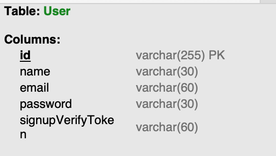

# 8. Type ORM 

### 1. Connection
_1. app.module.ts_
```js
@Module({
  imports: [
    UsersModule,
    ConfigModule.forRoot({
      envFilePath: [`${__dirname}/config/env/.${process.env.NODE_ENV}.env`],
      load: [emailConfig],
      isGlobal: true,
      validationSchema,
    }),
    TypeOrmModule.forRoot({
      type: 'mysql',
      host: process.env.DATABASE_HOST, // 'localhost',
      port: 3306,
      username: process.env.DATABASE_USERNAME, // 'root',
      password: process.env.DATABASE_PASSWORD, // 'test',
      database: 'test',
      entities: [__dirname + '/**/*.entity{.ts,.js}'],  
      synchronize: process.env.DATABASE_SYNCHRONIZE === 'true', 
    }),
  ],
  controllers: [],
  providers: [],
})
```
- entities: TypeORM이 구동될 때 인식할 엔티티 클래스의 경로를 지정
- synchronize: 서비스 구동 시 소스 코드 기반으로 데이터 베이스의 스키마를 동기화할 지 여부
  - synchronize true로 지정되면 서비스가 실행되고 데이터 베이스가 연결될 때 데이터베이스가 초기화가 됨.
  - 운영환경에서는 true X


_2. ormconfig.json_
- typeorm 0.2x 버전대에서 주로 사용하는 방식, 0.3대에서 삭제
- 

### 2. 기본 TypeORM Options
```js
export declare type TypeOrmModuleOptions = {
    // 연결 재시도 횟수: 기본값 10
    retryAttempts?: number;
    
    // 재시도간 지연시간: 기본값 3초
    retryDelay?: number;
    
    // 에러시 연결 시도할지 판단하는 함수 구현부
    // 사용자 정의로직 추가 가능 및 특정 오류코드 및 메세지에 따른 재시도 여부 결정
    toRetry?: (err: any) => boolean;
    
    // 엔티티 자동 로드할지 여부
    autoLoadEntities?: boolean;
    
    // 애플리케이션 종료 후 연결을 유지할 지 여부
    keepConnectionAlive?: boolean;
    
    // 로깅 상세메세지 여부
    verboseRetryLog?: boolean;
}
```


### 3. 지원되는 DB ORM

```js
export declare type DataSourceOptions =
| MysqlConnectionOptions      // RDB, 관계형 데이터베이스 - 널리 사용되는 오픈 소스 RDBMS
| PostgresConnectionOptions   // RDB, 관계형 데이터베이스 - 고급 기능을 갖춘 오픈 소스 RDBMS
| CockroachConnectionOptions  // NewSQL, 분산형 SQL 데이터베이스 - 높은 가용성과 스케일링 지원
| SqliteConnectionOptions     // RDB, 관계형 데이터베이스 - 서버리스, 내장형 데이터베이스
| SqlServerConnectionOptions  // RDB, 관계형 데이터베이스 - Microsoft의 상업용 데이터베이스 시스템
| SapConnectionOptions        // RDB, 관계형 데이터베이스 - SAP의 상업용 데이터베이스 시스템
| OracleConnectionOptions     // RDB, 관계형 데이터베이스 - 대규모 상업용 데이터베이스 시스템
| CordovaConnectionOptions    // Mobile, 하이브리드 모바일 애플리케이션용 데이터베이스
| NativescriptConnectionOptions // Mobile, 네이티브 모바일 애플리케이션용 데이터베이스
| ReactNativeConnectionOptions  // Mobile, React Native 애플리케이션용 데이터베이스
| SqljsConnectionOptions      // In-memory, 메모리 내 데이터베이스 - 브라우저 및 Node.js용
| MongoConnectionOptions      // NoSQL, 문서 지향 데이터베이스 - JSON 유사 문서 저장
| AuroraMysqlConnectionOptions // RDB, 관계형 데이터베이스 - Amazon Aurora MySQL 호환
| AuroraPostgresConnectionOptions // RDB, 관계형 데이터베이스 - Amazon Aurora PostgreSQL 호환
| ExpoConnectionOptions       // Mobile, Expo 프레임워크용 데이터베이스
| BetterSqlite3ConnectionOptions // RDB, 관계형 데이터베이스 - 더 나은 성능의 SQLite3
| CapacitorConnectionOptions  // Mobile, Capacitor 프레임워크용 데이터베이스
| SpannerConnectionOptions    // NewSQL, 분산형 SQL 데이터베이스 - Google Cloud의 스케일 아웃 DB
```

### 4. 기본 사용법
_1. Entity 정의_
```js
import { Column, Entity, PrimaryColumn } from 'typeorm';

@Entity('User')
export class UserEntity {
  @PrimaryColumn()
  id: string;

  @Column({ length: 30 })
  name: string;

  @Column({ length: 60 })
  email: string;

  @Column({ length: 30 })
  password: string;

  @Column({ length: 60 })
  signupVerifyToken: string;
}
```
- synchronize 결과


_2. Repository Import_ 
```js
import { Module } from '@nestjs/common';
import { TypeOrmModule } from '@nestjs/typeorm';
import { EmailModule } from '../email/email.module';
import { UserEntity } from './entity/user.entity';
import { UsersController } from './users.controller';
import { UsersService } from './users.service';

@Module({
  imports: [EmailModule, TypeOrmModule.forFeature([UserEntity])],
  controllers: [UsersController],
  providers: [UsersService],
})
export class UsersModule {}
```

_3. User Entity와 연결된 Repository Injection_
```js
@Injectable()
export class UsersService {
  constructor(
          private emailService: EmailService,
  @InjectRepository(UserEntity)
  private usersRepository: Repository<UserEntity>,
  private dataSource: DataSource,
) {}
```

_4. Create_
```js
  private async saveUser(
        name: string,
        email: string,
        password: string,
        signupVerifyToken: string,
) {
  const user = new UserEntity();
  user.id = ulid();
  user.name = name;
  user.email = email;
  user.password = password;
  user.signupVerifyToken = signupVerifyToken;
  await this.usersRepository.save(user);
}
```

_5. Read_
```js
  private async checkUserExists(emailAddress: string): Promise<boolean> {
    const user = await this.usersRepository.findOne({
      where: {
        email: emailAddress,
      },
    });

    return user !== null;
  }
```

_6. ETC_
- 그 외 update, upsert, delete, softDelete 등 수많은 default api 제공
- https://orkhan.gitbook.io/typeorm/docs/repository-api


### 5. Transaction
_1. QueryRunner_

```js
import { DataSource, Repository } from 'typeorm';
import { UserEntity } from './entity/user.entity';

@Injectable()
export class UsersService {
  constructor(
    private emailService: EmailService,
    @InjectRepository(UserEntity)
    private usersRepository: Repository<UserEntity>,
    private dataSource: DataSource,
  ) {}

// ...
// ...

  private async saveUserUsingQueryRunner(
          name: string,
          email: string,
          password: string,
          signupVerifyToken: string,
  ) {
    const queryRunner = this.dataSource.createQueryRunner();
  
    await queryRunner.connect();
    await queryRunner.startTransaction();
  
    try {
      const user = new UserEntity();
      user.id = ulid();
      user.name = name;
      user.email = email;
      user.password = password;
      user.signupVerifyToken = signupVerifyToken;
  
      await queryRunner.manager.save(user);
  
      throw new InternalServerErrorException(); // 일부러 에러를 발생시켜 본다
  
      await queryRunner.commitTransaction();
    } catch (e) {
      // 에러가 발생하면 롤백
      await queryRunner.rollbackTransaction();
      throw new InternalServerErrorException(); // 일부러 에러를 발생시켜 본다
    } finally {
      // 직접 생성한 QueryRunner는 해제시켜 주어야 함
      await queryRunner.release();
    }
  }
```
- DataSource의 역할
- https://typeorm.biunav.com/en/data-source-api.html
  1. 데이터베이스 연결 설정
  2. 연결 풀 관리/트랜젝션 관리
  3. 엔티티 관리
  4. 마이그레이션 관리
  5. 쿼리 실행
- QueryRunner가 Transaction을 관리하는 3가지 방법
  - startTransaction
  - commitTransaction
  - rollbackTransaction
- 고의 에러를 발생시 rollbackTransation을 통해 실제 db에 write작업이 발생되지 않음


_2. transaction_
```js
import { DataSource, Repository } from 'typeorm';
import { UserEntity } from './entity/user.entity';

@Injectable()
export class UsersService {
  constructor(
    private emailService: EmailService,
    @InjectRepository(UserEntity)
    private usersRepository: Repository<UserEntity>,
    private dataSource: DataSource,
  ) {}

// ...
// ...

  private async saveUserUsingTransaction(
          name: string,
          email: string,
          password: string,
          signupVerifyToken: string,
  ) {
    await this.dataSource.transaction(async (manager) => {
      const user = new UserEntity();
      user.id = ulid();
      user.name = name;
      user.email = email;
      user.password = password;
      user.signupVerifyToken = signupVerifyToken;
  
      await manager.save(user);
      throw new InternalServerErrorException();
    });
  }
```
```js 
transaction<T>(runInTransaction: (entityManager: EntityManager) => Promise<T>): Promise<T>;
```
- entityManager를 통해서 DB 작업이 이루어짐
- entityManager를 callback으로 받아 사용자 수행 작업을 정의
- 해당 transation 내부의 모든 작업이 성공적으로 완료되지 않으면 전체 트랜젝션을 롤백


### 6. Migration
- package.json > scripts
```json
{
  "typeorm": "ts-node -r tsconfig-paths/register ./node_modules/typeorm/cli.js"
}
```

- ormconfig.ts
```js
import { DataSource } from 'typeorm';
export const AppDataSource = new DataSource({
  type: 'mysql',
  host: 'localhost',
  port: 3306,
  username: 'root',
  password: 'test',
  database: 'test',
  entities: [__dirname + '/**/*.entity{.ts,.js}'],
  synchronize: false,
  migrations: [__dirname + '/**/migrations/*.js'],
  migrationsTableName: 'migrations',
});
```

- cli
```bash
npm run typeorm migration:create src/migrations/CreateUserTable
```
> Migration /Users/jeongsuhwan/WebstormProjects/nestjs-study/src/migrations/1719857538699-CreateUserTable.ts has been generated successfully.

- migration:create시 생성파일 (template)
- up method는 마이그레이션이 수행될때 실행되는 코드 작성부
- down method는 마이그레이션을 되돌릴때 실행되는 코드 작성부
```js
import { MigrationInterface, QueryRunner } from "typeorm";

export class CreateUserTable1719857538699 implements MigrationInterface {

    public async up(queryRunner: QueryRunner): Promise<void> {
    }

    public async down(queryRunner: QueryRunner): Promise<void> {
    }

}
```

- 직접 작성을 원하지 않으니 migration:generate cli 사용
```bash
npm run typeorm migration:generate src/migrations/CreateUserTable -- -d ./ormconfig.ts
```
> Migration /Users/jeongsuhwan/WebstormProjects/nestjs-study/src/migrations/1719857731481-CreateUserTable.ts has been generated successfully.

```js
import { MigrationInterface, QueryRunner } from "typeorm";

export class CreateUserTable1719857731481 implements MigrationInterface {
    name = 'CreateUserTable1719857731481'

    public async up(queryRunner: QueryRunner): Promise<void> {
        await queryRunner.query(`CREATE TABLE \`User\` (\`id\` varchar(255) NOT NULL, \`name\` varchar(30) NOT NULL, \`email\` varchar(60) NOT NULL, \`password\` varchar(30) NOT NULL, \`signupVerifyToken\` varchar(60) NOT NULL, PRIMARY KEY (\`id\`)) ENGINE=InnoDB`);
    }

    public async down(queryRunner: QueryRunner): Promise<void> {
        await queryRunner.query(`DROP TABLE \`User\``);
    }

}
```

- migration:run 실행
```bash
npm run typeorm migration:run -- -d ./ormconfig.ts
```
> query: SELECT VERSION() AS `version` <br/>
query: SELECT * FROM `INFORMATION_SCHEMA`.`COLUMNS` WHERE `TABLE_SCHEMA` = 'test' AND `TABLE_NAME` = 'migrations' <br/>
query: SELECT * FROM `test`.`migrations` `migrations` ORDER BY `id` DESC <br/>
0 migrations are already loaded in the database. <br/>
1 migrations were found in the source code. <br/>
1 migrations are new migrations must be executed. <br/>
query: START TRANSACTION <br/>
query: CREATE TABLE `User` (`id` varchar(255) NOT NULL, `name` varchar(30) NOT NULL, `email` varchar(60) NOT NULL, `password` varchar(30) NOT NULL, `signupVerifyToken` varchar(60) NOT NULL, PRIMARY KEY (`id`)) ENGINE=InnoDB <br/>
query: INSERT INTO `test`.`migrations`(`timestamp`, `name`) VALUES (?, ?) -- PARAMETERS: [1640444480113,"CreateUserTable1640444480113"] <br/>
Migration CreateUserTable1640444480113 has been  executed successfully. <br/>
query: COMMIT <br/>

- migration 결과 생성 테이블

- migration versioning 테이블


- migration:revert 실행
```bash
npm run typeorm migration:revert -- -d ./ormconfig.ts
```
> query: SELECT VERSION() AS `version` <br/>
query: SELECT * FROM `INFORMATION_SCHEMA`.`COLUMNS` WHERE `TABLE_SCHEMA` = 'test' AND `TABLE_NAME` = 'migrations' <br/>
query: SELECT * FROM `test`.`migrations` `migrations` ORDER BY `id` DESC <br/>
1 migrations are already loaded in the database. <br/>
CreateUserTable1640444480113 is the last executed migration. It was executed on Sun Dec 26 2021 00:01:20 GMT+0900 (Korean Standard Time). <br/>
Now reverting it... <br/>
query: START TRANSACTION <br/>
query: DROP TABLE `User` <br/>
query: DELETE FROM `test`.`migrations` WHERE `timestamp` = ? AND `name` = ? -- PARAMETERS: [1640444480113,"CreateUserTable1640444480113"] <br/>
Migration CreateUserTable1640444480113 has been  reverted successfully. <br/>
query: COMMIT <br/>

- migration versioning 테이블


